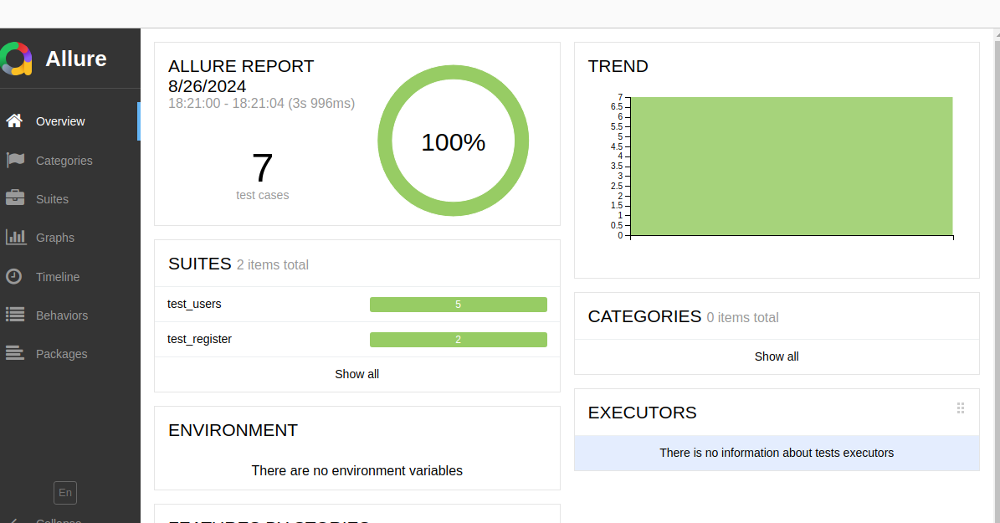
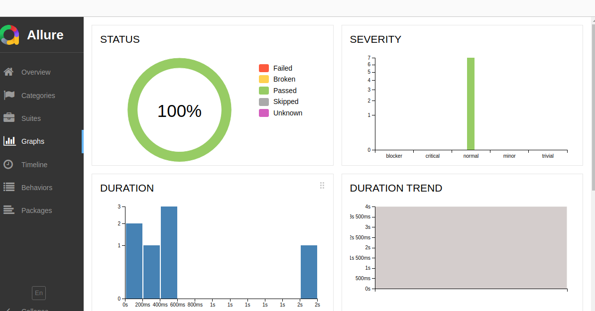

# Python API Automation Framework

Python API Automation Framework with Pytest

## Installation

Install the requirements using the below,

```bash
pip install -r requirements.txt
```


## Project features

**Pytest** - Testing framework for executing test cases

**JSON** - Light weight data interchange format, used to fetch endpoints information

**Pandas** - Pandas, a data visualization library is used to read and write the data from and into the excel sheet 

**Data-driven tests** - Tests are data-driven with data being fetched from Excel (.xlsx) file

**Logger** - Logging mechanism is implemented in each test case for debugging.

**Allure** - Allure reports are used to generate the test results.


## To setup allure in Ubuntu

Install the packages as already described in requirements.txt


Download the allure *.zip file from the below link,

https://github.com/allure-framework/allure2/releases/tag/2.30.0

Create a directory named tools under user home path

```bash
$ mkdir ~/tools
```

Move the zip file under the tools directory
```bash
$ sudo mv allure-2.30.0.zip ~/tools
```

Unzip the allure zip file
```bash
~/tools$ sudo unzip allure-2.30.0.zip
```

Install the below package in your local machine

```bash
sudo apt-get install default-jdk
```

Check whether the below path exists,

```bash
/usr/lib/jvm/java-1.21.0-openjdk-amd64
```

Add the JAVA_HOME path, Path of the allure (at the end of the PATH variable) inside /etc/environment and execute the source /etc/environment command to reflect changes.

Note: Make a backup of the environment file before making any changes.
```bash
$ cat /etc/environment
PATH="/usr/local/sbin:/usr/local/bin:/usr/sbin:/usr/bin:/sbin:/bin:/usr/games:/usr/local/games:/snap/bin:/home/ubuntuvm/tools/allure-2.30.0/bin"
JAVA_HOME="/usr/lib/jvm/java-1.21.0-openjdk-amd64"

$ source /etc/environment
```

Inside the Pycharm virtual environment, make the below changes and run the following commands,

Move to .venv/bin/activate folder and add the below line at the end,

```bash
export PATH=$PATH:/home/ubuntuvm/tools/allure-2.30.0/bin
```

Execute the below command,
```bash
source ./venv/bin/activate
```

Check the allure version using the below command,

```bash
$ allure --version
2.30.0
```

## Execution

Move to the tests folder and execute the below command,

```bash
Below command is to generate the tests using pytest
$  pytest -rA --alluredir=../reports/allure_reports

Generate the allure reports using the below command,
```bash
$ allure generate ../reports/allure_reports -o ../allure_reports
```

Move all the contents inside the ../reports/allure_reports directory
```bash
$ mv ../allure_reports/* ../reports/allure_reports/
```

Delete the empty allure reports directory

```bash
$ rm -r ../allure_reports/
```

generate the allure report using the below command

```bash
$ allure serve ../reports/allure_reports/
```

## Allure results:





Allure results can be analyzed for further tests analysis.